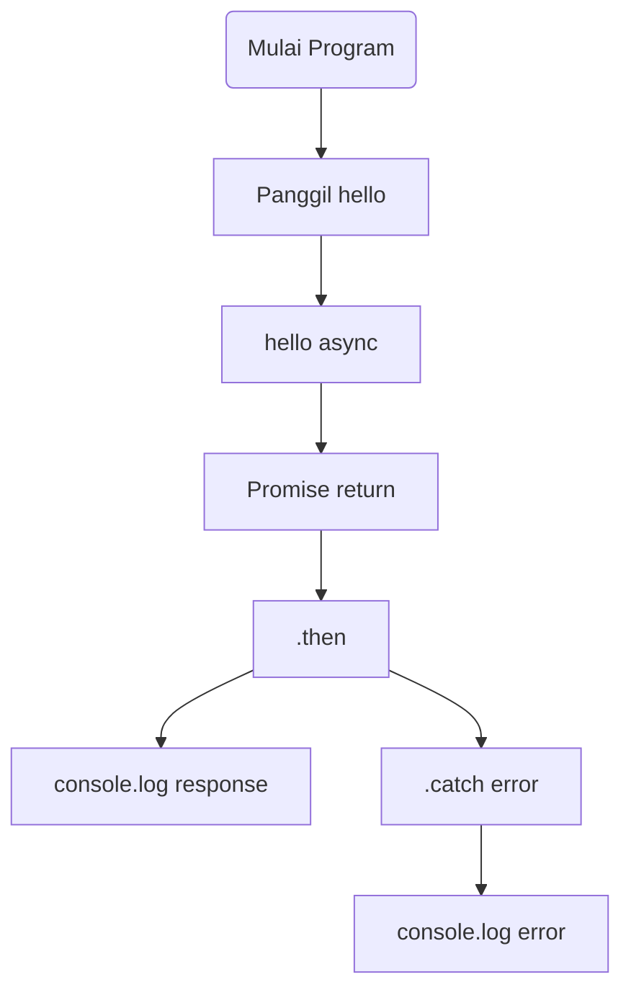

```mermaid
flowchart TD
    A(Mulai Program) --> B[Panggil hello]
    B --> C[hello async]
    C --> D[Promise return]
    D --> E[.then]
    E --> F[console.log response]
    E --> G[.catch error]
    G --> H[console.log error]

```