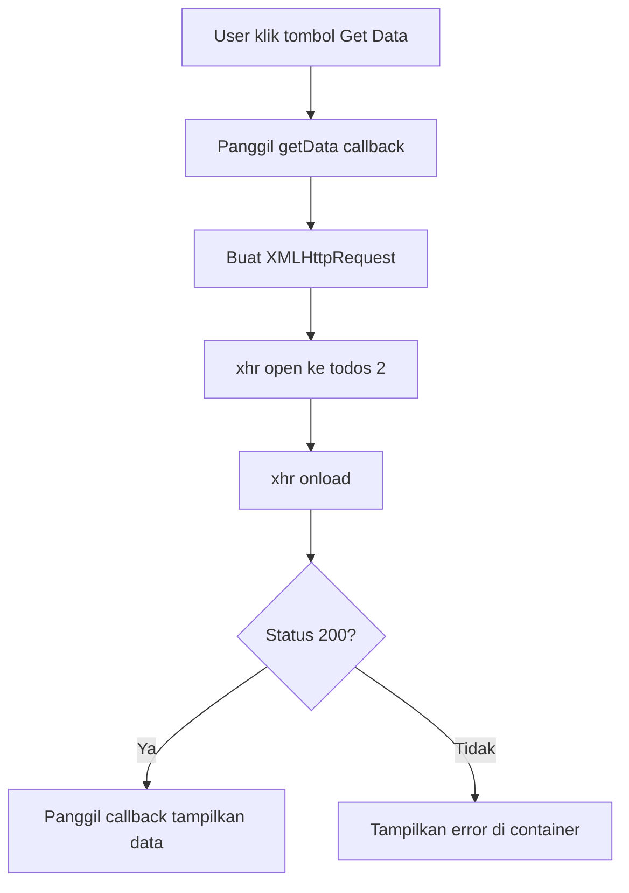

```mermaid
flowchart TD
    A[User klik tombol Get Data] --> B[Panggil getData callback]
    B --> C[Buat XMLHttpRequest]
    C --> D[xhr open ke todos 2]
    D --> E[xhr onload]
    E --> F{Status 200?}
    F -- Ya --> G[Panggil callback tampilkan data]
    F -- Tidak --> H[Tampilkan error di container]

```