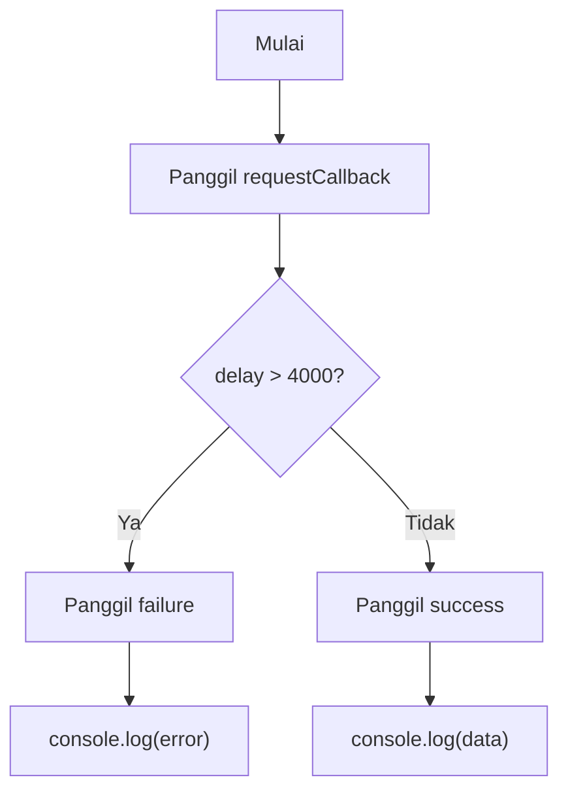

```mermaid
flowchart TD
    A[Mulai] --> B["Panggil requestCallback"]
    B --> C{"delay > 4000?"}
    C -- Ya --> D["Panggil failure"]
    D --> E["console.log(error)"]
    C -- Tidak --> F["Panggil success"]
    F --> G["console.log(data)"]

```