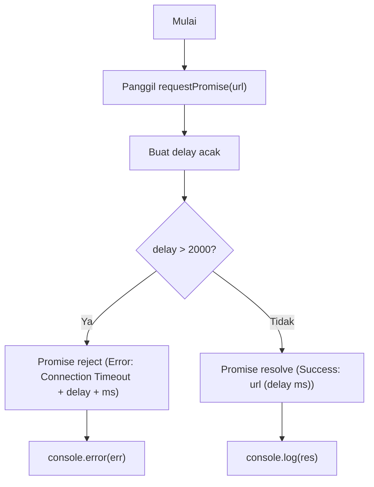

```mermaid
flowchart TD
    A[Mulai] --> B["Panggil requestPromise(url)"]
    B --> C["Buat delay acak"]
    C --> D{"delay > 2000?"}
    D -- Ya --> E["Promise reject (Error: Connection Timeout <br> + delay + ms)"]
    E --> F["console.error(err)"]
    D -- Tidak --> G["Promise resolve (Success: url (delay ms))"]
    G --> H["console.log(res)"]

```