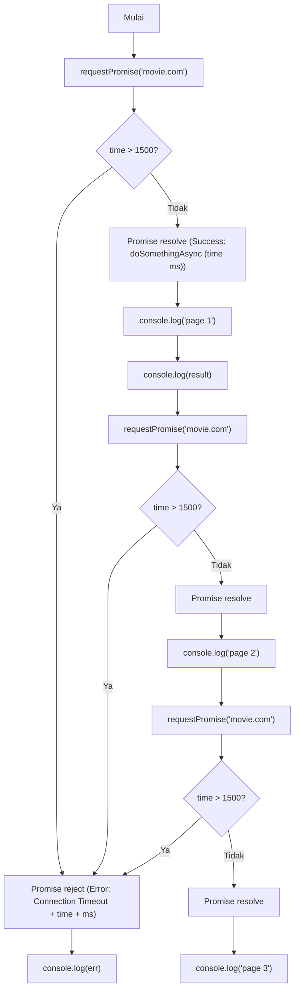

```mermaid
flowchart TD
    A[Mulai] --> B["requestPromise('movie.com')"]
    B --> C{"time > 1500?"}
    C -- Ya --> Z["Promise reject (Error: Connection Timeout <br> + time + ms)"] --> AA["console.log(err)"]
    C -- Tidak --> D["Promise resolve (Success: doSomethingAsync (time ms))"]
    D --> E["console.log('page 1')"]
    E --> F["console.log(result)"]
    F --> G["requestPromise('movie.com')"]
    G --> H{"time > 1500?"}
    H -- Ya --> Z
    H -- Tidak --> I["Promise resolve"] --> J["console.log('page 2')"]
    J --> K["requestPromise('movie.com')"]
    K --> L{"time > 1500?"}
    L -- Ya --> Z
    L -- Tidak --> M["Promise resolve"] --> N["console.log('page 3')"]

```