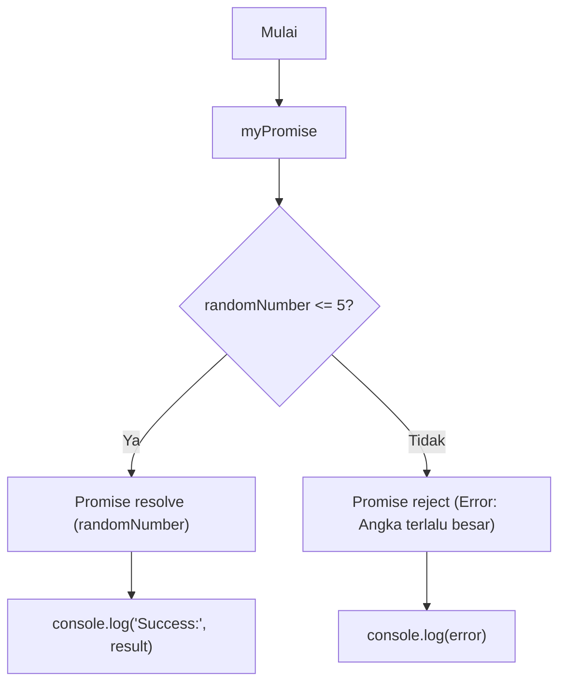

```mermaid
flowchart TD
    A[Mulai] --> B["myPromise"]
    B --> C{"randomNumber <= 5?"}
    C -- Ya --> Z["Promise resolve (randomNumber)"] --> AA["console.log('Success:', result)"]
    C -- Tidak --> D["Promise reject (Error: Angka terlalu besar)"]
    D --> E["console.log(error)"]

```