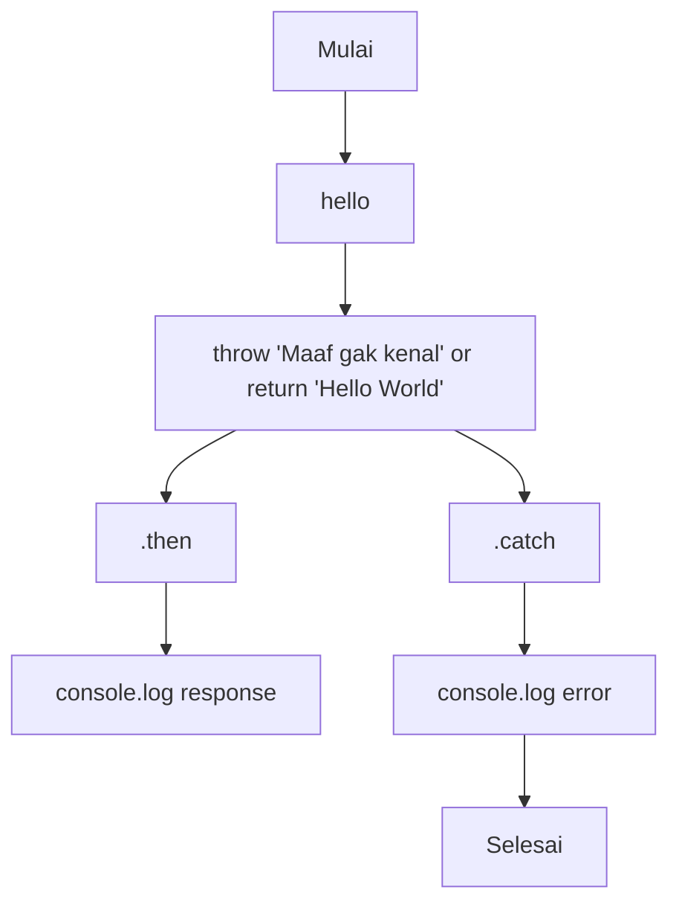
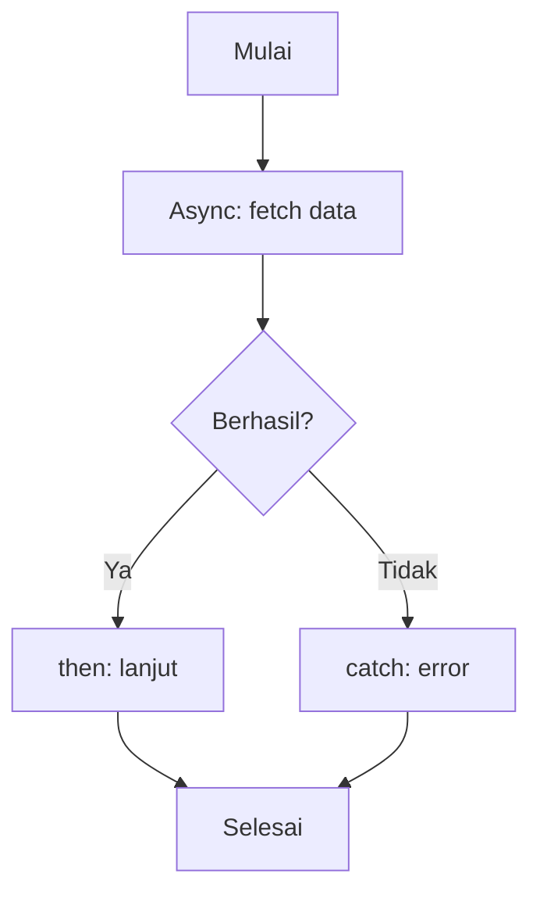

```mermaid
flowchart TD
    A[Mulai] --> B[hello]
    B --> C[throw 'Maaf gak kenal' or return 'Hello World']
    C --> D[.then]
    D --> E[console.log response]
    C --> F[.catch]
    F --> G[console.log error]
    G --> H[Selesai]

```

```mermaid
flowchart TD
    A[Mulai] --> B[Async: fetch data]
    B --> C{Berhasil?}
    C -- Ya --> D[then: lanjut]
    C -- Tidak --> E[catch: error]
    D --> F[Selesai]
    E --> F
```
