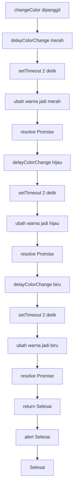

```mermaid
flowchart TD
    A[changeColor dipanggil] --> B[delayColorChange merah]
    B --> C[setTimeout 2 detik]
    C --> D[ubah warna jadi merah]
    D --> E[resolve Promise]
    E --> F[delayColorChange hijau]
    F --> G[setTimeout 2 detik]
    G --> H[ubah warna jadi hijau]
    H --> I[resolve Promise]
    I --> J[delayColorChange biru]
    J --> K[setTimeout 2 detik]
    K --> L[ubah warna jadi biru]
    L --> M[resolve Promise]
    M --> N[return Selesai]
    N --> O[alert Selesai]
    O --> P[Selesai]

```

