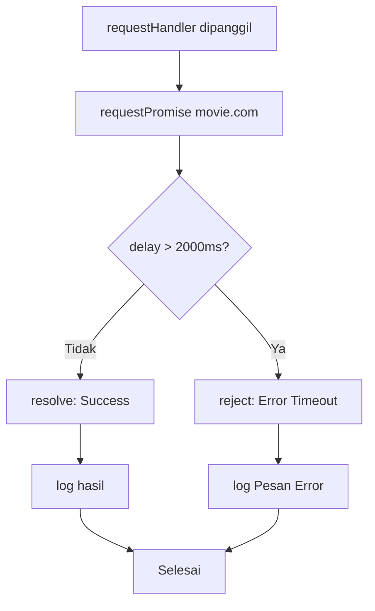

```mermaid
flowchart TD
    A[requestHandler dipanggil] --> B[requestPromise movie.com]
    B --> C{delay > 2000ms?}
    C -- Tidak --> D[resolve: Success]
    D --> E[log hasil]
    E --> F[Selesai]
    C -- Ya --> G[reject: Error Timeout]
    G --> H[log Pesan Error]
    H --> F

```

